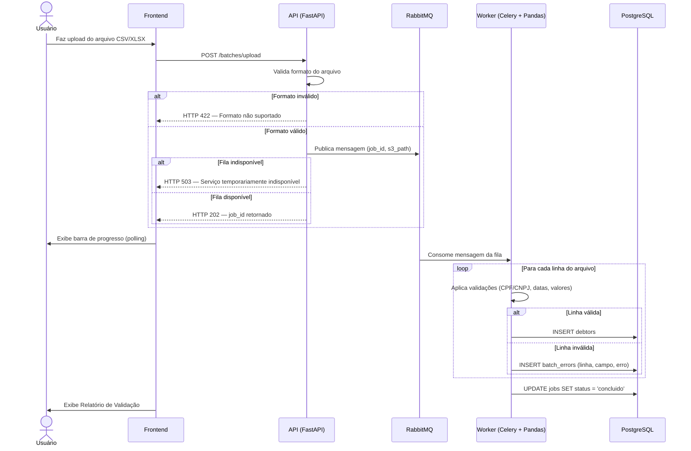
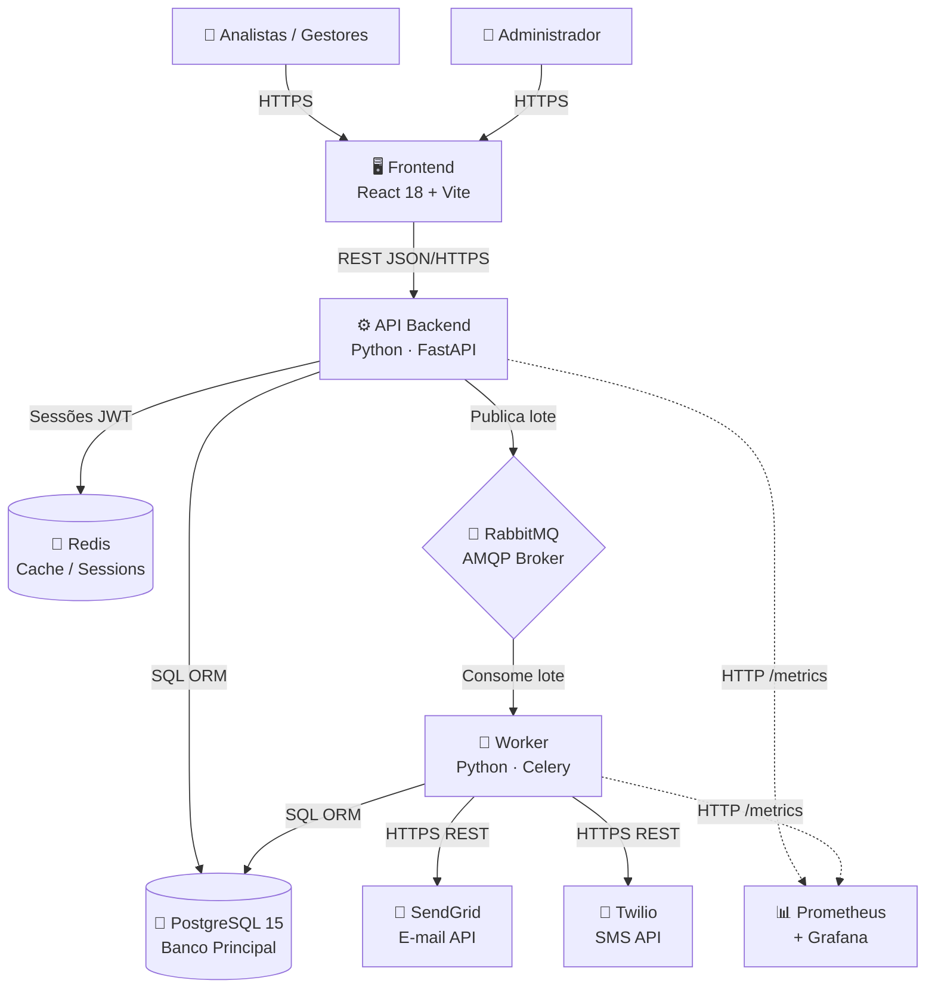

<p align="center">
  
</p>

<h1 align="center">Plataforma de Cobrança Automatizada</h1>

<p align="center">
  <strong>RFC — Request for Comments · Proposta Técnica de Projeto de Portfólio</strong><br/>
  Engenharia de Software · Católica SC · 2026
</p>

<p align="center">
  
  
  
  
</p>

<p align="center">
  
  
  
  
  
  
  
  
</p>

---

## Sumário

- [1. Visão do Produto e Impacto](#1-visão-do-produto-e-impacto)
  - [1.1 Contexto e Problema](#11-contexto-e-problema)
  - [1.2 Origem da Demanda e Evidências](#12-origem-da-demanda-e-evidências)
  - [1.3 Benchmark — Soluções Existentes](#13-benchmark--soluções-existentes)
  - [1.4 Público-Alvo](#14-público-alvo)
  - [1.5 Objetivos do Projeto](#15-objetivos-do-projeto)
  - [1.6 Métricas de Sucesso (KPIs)](#16-métricas-de-sucesso-kpis)
- [2. Engenharia de Requisitos](#2-engenharia-de-requisitos)
  - [2.1 Personas](#21-personas)
  - [2.2 Casos de Uso Principais](#22-casos-de-uso-principais)
  - [2.3 Requisitos Funcionais](#23-requisitos-funcionais)
  - [2.4 Requisitos Não Funcionais](#24-requisitos-não-funcionais)
  - [2.5 Regras de Negócio](#25-regras-de-negócio)
  - [2.6 Fora do Escopo](#26-fora-do-escopo)
- [3. Fluxos e Comportamento do Sistema](#3-fluxos-e-comportamento-do-sistema)
  - [3.1 Fluxo Principal — Ingestão e Validação](#31-fluxo-principal--ingestão-e-validação)
  - [3.2 Fluxo Secundário — Régua de Cobrança](#32-fluxo-secundário--régua-de-cobrança)
  - [3.3 Fluxos Alternativos e Exceções](#33-fluxos-alternativos-e-exceções)
- [4. UX e Mockups](#4-ux-e-mockups)
  - [4.1 Fluxo de Navegação](#41-fluxo-de-navegação)
  - [4.2 Telas Principais](#42-telas-principais)
- [5. Arquitetura do Sistema](#5-arquitetura-do-sistema)
  - [5.1 Diagramas C4](#51-diagramas-c4)
  - [5.2 Modelo de Dados](#52-modelo-de-dados)
  - [5.3 Stack Tecnológica](#53-stack-tecnológica)
- [6. Segurança e Privacidade](#6-segurança-e-privacidade)
  - [6.1 Controles de Segurança](#61-controles-de-segurança)
  - [6.2 Conformidade LGPD](#62-conformidade-lgpd)
- [7. Planejamento do Projeto](#7-planejamento-do-projeto)
- [8. Referências](#8-referências)
- [9. Apêndices](#9-apêndices)
- [10. Parecer do Comitê de Avaliação](#10-parecer-do-comitê-de-avaliação)

---

## 1. Visão do Produto e Impacto

### 1.1 Contexto e Problema

A inadimplência é um desafio estrutural para empresas de diversos segmentos no Brasil. Segundo dados do **Serasa Experian**, o país ultrapassa **70 milhões de pessoas físicas inadimplentes**, e empresas de médio porte perdem, em média, entre **3% e 8% da receita bruta anual** em decorrência de cobranças mal executadas ou não realizadas.

O processo tradicional de cobrança é majoritariamente **manual**: analistas exportam planilhas do ERP _(Enterprise Resource Planning)_, filtram devedores individualmente, enviam e-mails um a um e registram contatos em sistemas separados.

> ⚠️ **Este fluxo apresenta limitações críticas que impedem escala e rastreabilidade:**

  
| Problema | Impacto |
|---|---|
| Processo 100% manual | Alto custo operacional com tarefas repetitivas |
| Régua inconsistente | Cada analista aplica critérios diferentes |
| Sem rastreabilidade | Impossível auditar ações realizadas |
| Sem escala | Necessidade de ampliar equipe para crescer |
| Sem realimentação | Pagamentos e negociações não retornam ao sistema |


**A solução proposta** substitui esse fluxo por uma plataforma web integrada que automatiza a ingestão de dados de inadimplentes, aplica regras de cobrança configuráveis e executa disparos de comunicação multicanal — **e-mail, SMS e WhatsApp** — de forma programada e monitorada.

---

### 1.2 Origem da Demanda e Evidências

Foram realizadas entrevistas exploratórias com **5 profissionais da área financeira** e **15 profissionais da área de cobrança** da empresa parceira **Consulth Soluções Empresariais**.

<table>
  <thead>
    <tr><th>Dor identificada</th><th>% dos entrevistados</th></tr>
  </thead>
  <tbody>
    <tr><td>Processo de cobrança 100% manual</td><td><strong>100%</strong></td></tr>
    <tr><td>Dificuldade em padronizar a régua entre analistas</td><td><strong>100%</strong></td></tr>
    <tr><td>Sem rastreabilidade das comunicações enviadas</td><td><strong>>80%</strong></td></tr>
    <tr><td>Uso de planilhas + e-mail corporativo sem integração</td><td><strong>100%</strong></td></tr>
  </tbody>
</table>

---

### 1.3 Benchmark — Soluções Existentes

Foram analisadas as principais soluções do mercado que tentam resolver o mesmo problema:

| Solução | Público-Alvo | Pontos Fortes | Limitações |
|---|---|---|---|
| **Receita Certa** | PMEs | Interface amigável, integração com Pix | Sem customização de régua; sem importação por CSV |
| **Assertiva Cobranças** | Médio porte | Automação básica de comunicação | Custo elevado; sem observabilidade |
| **Iugu / Vindi** | E-commerce e SaaS | Plataforma de pagamentos robusta | Foco em recorrência, não em carteiras de cobrança |
| **Planilha + E-mail** | Qualquer empresa | Baixo custo, familiar | Sem automação, rastreabilidade ou escala |

> 💡 **Diferencial do projeto:** Nenhuma solução analisada oferece **simultaneamente**: importação flexível via CSV/Excel com validação automatizada + configuração visual da régua por perfil de devedor + monitoramento em tempo real via dashboard. A plataforma preenche essa lacuna com arquitetura moderna, open source e auditável.

---

### 1.4 Público-Alvo

O sistema é direcionado a **empresas de médio porte** — cooperativas, varejistas, clínicas e prestadoras de serviço — que gerenciam internamente suas carteiras de inadimplentes.

| Perfil | Descrição |
|---|---|
| **Analista de Cobrança** (usuário primário) | Realiza importações de lotes e monitora disparos via portal web. Conhecimento tecnológico intermediário. |
| **Gestor Financeiro** (usuário secundário) | Configura a régua de cobrança e analisa métricas e dashboards. |
| **Administrador** | Gerencia usuários, permissões e configurações globais do sistema. |

> 🤝 **Parceiro institucional:** Desenvolvido em parceria com a [**Consulth Soluções Empresariais**](https://www.consulth.com.br) — CNPJ 33.536.315/0001-07 — especialista em recuperação de crédito e cobrança B2B.

---

### 1.5 Objetivos do Projeto

**Objetivo Geral**

> Desenvolver uma plataforma web para automação do ciclo de cobrança de inadimplentes, desde a ingestão e validação de dados até o disparo multicanal de comunicações e o monitoramento dos resultados, com arquitetura orientada a qualidade, segurança e observabilidade.

**Objetivos Específicos**

1. ✅ Implementar pipeline assíncrono de ingestão e validação de arquivos CSV/Excel com feedback detalhado de erros por linha
2. ✅ Desenvolver módulo de configuração visual da régua de cobrança (canais e prazos por perfil de devedor)
3. ✅ Automatizar a execução de jobs de disparo de comunicações com agendamento configurável
4. ✅ Criar dashboard de monitoramento com métricas de execução, taxa de entrega e conversão
5. ✅ Garantir qualidade com TDD, CI/CD automatizado e análise estática via SonarCloud

---

### 1.6 Métricas de Sucesso (KPIs)

| KPI | Meta |
|---|---|
| Tempo de resposta da API (P95) | `< 300ms` |
| Throughput de processamento de lote | `> 10.000 registros/minuto` |
| Cobertura de testes — backend (pytest) | `≥ 80%` |
| Cobertura de testes — frontend (Jest) | `≥ 25%` |
| Disponibilidade do serviço | `≥ 99%` |
| Taxa de sucesso nos disparos de e-mail | `> 95%` |
| Quality Gate SonarCloud | `Aprovado` (sem blockers/criticals) |

---

## 2. Engenharia de Requisitos

### 2.1 Personas

<table>
<tr>
<td width="50%" valign="top">

**👤 Heloizi Vargas — Analista de Cobrança**

- **Contexto:** Trabalha em uma cooperativa de crédito. Gerencia ~2.000 devedores por mês.
- **Objetivo:** Enviar comunicações de cobrança sem processo manual linha a linha.
- **Dores:**
  - Perde horas exportando planilhas do ERP e enviando e-mails individualmente
  - Comete erros ao filtrar devedores por prazo, gerando cobranças indevidas e potenciais processos jurídicos

</td>
<td width="50%" valign="top">

**👤 Fellipe Junkes — Gestor Financeiro**

- **Contexto:** Responsável pela estratégia de recuperação de crédito B2B.
- **Objetivo:** Visualizar em tempo real o desempenho das campanhas e ajustar a régua conforme o perfil dos devedores.
- **Dores:**
  - Não tem visibilidade sobre quais ações foram tomadas
  - Não consegue mensurar o retorno das comunicações enviadas

</td>
</tr>
</table>

---

### 2.2 Casos de Uso Principais

| Código | Caso de Uso | Ator Principal |
|---|---|---|
| **UC01** | Importar lote de devedores via arquivo CSV/Excel | Analista |
| **UC02** | Visualizar relatório de validação do lote importado | Analista |
| **UC03** | Configurar régua de cobrança (canal, prazo, mensagem) | Gestor |
| **UC04** | Visualizar lista de devedores e seus status de comunicação | Analista / Gestor |
| **UC05** | Monitorar execução dos jobs de disparo em tempo real | Gestor |
| **UC06** | Consultar histórico de comunicações enviadas por devedor | Analista |
| **UC07** | Gerenciar usuários e permissões de acesso | Administrador / Gestor (limitado) |

**Responsabilidades por Ator:**

- **Analista de Cobrança:** UC01, UC02, UC04, UC06
- **Gestor Financeiro:** UC03, UC04, UC05 + UC07 _(apenas perfil Operador)_
- **Administrador:** UC07 _(acesso total — todos os perfis, logs de auditoria)_

> 📐 Os diagramas UML completos de casos de uso estão disponíveis nos [Apêndices](#9-apêndices).

---

### 2.3 Requisitos Funcionais

| ID | Requisito |
|---|---|
| **RF01** | O sistema deve permitir upload de arquivos CSV e Excel (`.xlsx`) com dados de devedores |
| **RF02** | O sistema deve processar o arquivo de forma **assíncrona** e exibir o progresso em tempo real |
| **RF03** | O sistema deve validar cada linha do arquivo importado e exibir relatório detalhado de erros por linha |
| **RF04** | O sistema deve permitir configuração da régua de cobrança (canal: e-mail, SMS, WhatsApp; prazo; template) |
| **RF05** | O sistema deve permitir visualização da lista de devedores com filtros por status, prazo e canal |
| **RF06** | O sistema deve executar **jobs programados** para disparo conforme a régua configurada |
| **RF07** | O sistema deve registrar o resultado de cada tentativa de disparo (sucesso, falha, bounce) |
| **RF08** | O sistema deve exibir dashboard com métricas: total de disparos, taxa de entrega e conversão |
| **RF09** | O sistema deve autenticar usuários com controle de perfis (operador, gestor, administrador) |
| **RF10** | O sistema deve permitir ao administrador gerenciar usuários e permissões |

---

### 2.4 Requisitos Não Funcionais

| ID | Requisito |
|---|---|
| **RNF01** | Suportar ao menos **100 usuários simultâneos** sem degradação de desempenho |
| **RNF02** | Tempo de resposta das rotas de API **< 300ms** no percentil 95 (P95) |
| **RNF03** | Pipeline de lotes deve suportar arquivos com até **50.000 registros** |
| **RNF04** | Autenticação via **JWT** com access token de curta duração e refresh token |
| **RNF05** | Dados sensíveis armazenados com **criptografia em repouso** |
| **RNF06** | Cobertura mínima de **80%** nos testes automatizados do backend (pytest) |
| **RNF07** | CI/CD deve **impedir o deploy** caso os testes falhem ou o Quality Gate do SonarCloud não seja aprovado |
| **RNF08** | Sistema deve expor métricas no formato **Prometheus** para coleta e visualização no Grafana |
| **RNF09** | Todos os serviços devem ser **conteinerizados** com Docker e orquestrados via Docker Compose |

---

### 2.5 Regras de Negócio

| ID | Regra |
|---|---|
| **RN01** | Apenas usuários com perfil `operador` ou superior podem realizar importações de lotes |
| **RN02** | A régua de cobrança só pode ser ativada após ao menos uma regra válida ser configurada |
| **RN03** | Um devedor **não pode receber mais de uma comunicação** do mesmo canal no mesmo dia |
| **RN04** | Linhas com CPF/CNPJ inválido são **totalmente rejeitadas** e não ingressam na base |
| **RN05** | Jobs de disparo são executados apenas em **dias úteis**, entre **08h00 e 20h00** (horário de Brasília) |
| **RN06** | Apenas **administradores** podem criar, editar ou remover usuários do sistema |

---

### 2.6 Fora do Escopo

Os seguintes itens estão **explicitamente fora** do escopo desta versão:

- ❌ Integração direta com sistemas de pagamento ou emissão de boletos
- ❌ Portal de autoatendimento para o devedor final
- ❌ Módulo de negociação ou parcelamento de dívidas
- ❌ Importação via integração de API com ERPs externos
- ❌ Suporte a canais de voz (ligações telefônicas automatizadas)
- ❌ Aplicativo mobile nativo

---

## 3. Fluxos e Comportamento do Sistema

### 3.1 Fluxo Principal — Ingestão e Validação

O fluxo de ingestão é o ponto de entrada de dados no sistema.



**Etapas detalhadas:**

| Etapa | Ator | Descrição |
|---|---|---|
| 1 | Usuário | Acessa o portal e seleciona "Importar Lote" |
| 2 | Usuário | Faz upload do arquivo CSV ou Excel (.xlsx) |
| 3 | API Backend | Recebe o arquivo, valida o formato e publica na fila RabbitMQ |
| 4 | Worker Python | Consome a mensagem, lê o arquivo linha a linha usando pandas |
| 5 | Worker Python | Aplica validações: CPF/CNPJ, campos obrigatórios, formatos de data e valor |
| 6 | Worker Python | Persiste registros válidos no PostgreSQL e registra erros em tabela de log |
| 7 | API Backend | Atualiza o status do job no banco de dados |
| 8 | Frontend | Exibe relatório com totais: importados, rejeitados e erros por linha |

---

### 3.2 Fluxo Secundário — Régua de Cobrança

Os jobs de disparo são executados de forma **programada e automática**:

```
Celery Beat (Scheduler)
       │
       ▼ Aciona job no horário configurado
Worker consulta devedores elegíveis conforme régua ativa
       │
       ├──▶ Canal E-mail  →  POST SendGrid API  →  Registra resultado
       ├──▶ Canal SMS     →  POST Twilio API    →  Registra resultado
       │
       ├── Sucesso → INSERT communications (status = entregue)
       └── Falha   → Agenda retry +30min (máx. 3 tentativas)
                           │
                           └── Após 3 falhas → INSERT (status = falha_definitiva)

Dashboard atualizado com métricas consolidadas da operação
```

---

### 3.3 Fluxos Alternativos e Exceções

| Cenário | Comportamento do Sistema |
|---|---|
| **Arquivo com formato inválido** (não CSV/XLSX) | Retorna `HTTP 422` imediatamente, sem enfileirar |
| **Broker de mensagens indisponível** | Retorna `HTTP 503` com mensagem orientativa ao usuário |
| **Falha no disparo externo** (SendGrid/Twilio) | Registra falha com código de erro e agenda reenvio em 30 min (máx. 3 tentativas) |
| **Token JWT ausente ou expirado** | Qualquer rota protegida retorna `HTTP 401` e redireciona para login |

---

## 4. UX e Mockups

### 4.1 Fluxo de Navegação

A navegação do sistema é organizada em **três fluxos** partindo do Dashboard central:

```
[Login] ──────────────────────────────────────────▶ [Dashboard]
                                                         │
              ┌──────────────────┬───────────────────────┘
              │                  │                       │
              ▼                  ▼                       ▼
    FLUXO 1 · Importação  FLUXO 2 · Régua      FLUXO 3 · Monitoramento
              │                  │                       │
    [Importar Lote]    [Régua de Cobrança]     [Monitoramento]
              │                  │                       │
    [Processando...]   [Configurar Regra]      [Detalhe do Job]
              │                  │                       │
    [Relatório Valid.] [Lista de Devedores]    [Histórico do Devedor]
              │                  │                       │
              └──────────────────┴───────────────────────┘
                                 │
                           ◀ [Dashboard]
```

> 🎨 **Protótipo interativo:** [Acessar Figma](https://www.figma.com/design/aTgE91sZyzbxTrB8kh5clh/Plataforma-de-Cobran%C3%A7a-Automatizada?node-id=0-1&t=vxq6D6561lNc1dOZ-1)

---

### 4.2 Telas Principais

<table>
<thead>
<tr><th>Tela</th><th>Funcionalidade</th><th>Componentes Principais</th></tr>
</thead>
<tbody>
<tr>
<td><strong>① Login</strong></td>
<td>Autenticação corporativa via JWT</td>
<td>Formulário e-mail + senha, feedback de erro, link de recuperação</td>
</tr>
<tr>
<td><strong>② Dashboard</strong></td>
<td>Visão consolidada do dia</td>
<td>Cards de KPIs, gráfico de timeline de disparos (7 dias), alertas de falhas</td>
</tr>
<tr>
<td><strong>③ Importar Lote</strong></td>
<td>Upload de arquivos CSV/Excel</td>
<td>Área drag-and-drop, barra de progresso assíncrona, log em tempo real, planilha modelo</td>
</tr>
<tr>
<td><strong>④ Relatório de Validação</strong></td>
<td>Resultado da importação</td>
<td>Cards de totais (aprovados/rejeitados/%), tabela de erros por linha, exportação CSV</td>
</tr>
<tr>
<td><strong>⑤ Régua de Cobrança</strong></td>
<td>Configuração das regras de disparo</td>
<td>Cards de regras (5/15/30 dias), configuração de canal + template + horário, preview</td>
</tr>
<tr>
<td><strong>⑥ Monitoramento</strong></td>
<td>Acompanhamento dos jobs em tempo real</td>
<td>Lista de jobs com status e progresso, log estilo terminal, métricas por canal</td>
</tr>
</tbody>
</table>

**Fluxo de Interação — Importação de Lote:**

```
1. Usuário acessa "Importar Lote" pelo menu lateral
2. Arrasta arquivo CSV para a área de upload (ou clica para selecionar)
3. Sistema exibe barra de progresso enquanto o arquivo é enviado à API
4. API enfileira o processamento e retorna o ID do job
5. Frontend consulta periodicamente o status (polling ou WebSocket)
6. Ao concluir, sistema redireciona para o Relatório de Validação
7. Usuário revisa os erros, corrige o arquivo e pode reimportar
```

---

## 5. Arquitetura do Sistema

### 5.1 Diagramas C4

> 📐 Os diagramas C4 completos (Contexto, Containers e Componentes) em SVG estão disponíveis nos [Apêndices](#9-apêndices).

**Nível 1 — Contexto**

| Elemento | Tipo | Descrição |
|---|---|---|
| Analista de Cobrança | Usuário | Importa lotes e monitora disparos via portal web |
| Gestor Financeiro | Usuário | Configura régua e analisa métricas no dashboard |
| Administrador | Usuário | Gerencia usuários, permissões e configurações |
| SendGrid / AWS SES | Sistema Externo | API de disparo de e-mails transacionais |
| Twilio / AWS SNS | Sistema Externo | API de disparo de SMS |
| Prometheus + Grafana | Sistema Externo | Coleta e visualização de métricas de observabilidade |
| SonarCloud | Sistema Externo | Análise estática e quality gate no CI/CD |
| GitHub Actions | Sistema Externo | Orquestração do pipeline de CI/CD |

**Nível 2 — Containers**



**Nível 3 — Componentes (API Backend)**

A API segue uma arquitetura em **4 camadas** em cascata:

```
Request HTTP
     │
     ▼
┌─────────────────────────────────────────────────┐
│  CONTROLLERS (Routers FastAPI)                  │
│  BatchRouter · RulesRouter · JobsRouter         │
│  AuthRouter                                     │
│  → Recebem, validam e delegam                   │
└────────────────────┬────────────────────────────┘
                     │ delega
                     ▼
┌─────────────────────────────────────────────────┐
│  SERVICES (Lógica de Negócio)                   │
│  BatchService · NotificationService             │
│  AuthService · JobService                       │
│  → Orquestram repositórios e clients            │
└──────┬────────────────────────┬─────────────────┘
       │ acessa via ORM         │ aciona
       ▼                        ▼
┌─────────────────┐   ┌─────────────────────────────┐
│  REPOSITORIES   │   │  CLIENTS                    │
│  BatchRepo      │   │  EmailClient → SendGrid      │
│  DebtorRepo     │   │  SMSClient   → Twilio        │
│  CommRepo       │   │  BrokerClient → RabbitMQ     │
└────────┬────────┘   └─────────────────────────────┘
         │ SQL
         ▼
    PostgreSQL 15
```

| Camada | Componentes | Responsabilidade |
|---|---|---|
| **Controllers** | `BatchRouter`, `RulesRouter`, `JobsRouter`, `AuthRouter` | Recebem e validam requisições HTTP; delegam para Services |
| **Services** | `BatchService`, `NotificationService`, `AuthService`, `JobService` | Lógica de negócio; orquestram Repositories e Clients |
| **Repositories** | `BatchRepository`, `DebtorRepository`, `CommunicationRepository` | Abstração do banco via SQLAlchemy ORM |
| **Clients** | `EmailClient`, `SMSClient`, `BrokerClient` | Encapsulam comunicação com APIs externas |
| **Models/Schemas** | `Pydantic Models`, `SQLAlchemy Models` | Contratos de dados para validação e persistência |

---

### 5.2 Modelo de Dados

O banco de dados PostgreSQL é organizado em **7 entidades principais**:

```
users ──────┬──────────────────── collection_rules
            │                            │
            ▼                            ▼
         batches                       jobs ──────────┐
            │                                         │
       ┌────┴────┐                                    │
       ▼         ▼                                    ▼
  batch_errors  debtors ─────────────── communications
```

| Entidade | Campos principais | Relacionamentos |
|---|---|---|
| `users` | `id`, `email`, `password_hash`, `role`, `created_at` | Cria batches e configura regras |
| `batches` | `id`, `user_id`, `filename`, `status`, `total_rows`, `valid_rows`, `error_rows` | Pertence a users; gera debtors e batch_errors |
| `batch_errors` | `id`, `batch_id`, `row_number`, `field`, `error_message` | Pertence a batches |
| `debtors` | `id`, `batch_id`, `cpf_cnpj`, `name`, `email`, `phone`, `amount_due`, `due_date`, `status` | Pertence a batches; tem muitas communications |
| `collection_rules` | `id`, `user_id`, `days_overdue`, `channel`, `template_id`, `active` | Define a régua de cobrança |
| `jobs` | `id`, `rule_id`, `started_at`, `finished_at`, `status`, `dispatched`, `success`, `failed` | Pertence a collection_rules |
| `communications` | `id`, `debtor_id`, `job_id`, `channel`, `sent_at`, `status`, `error_code` | Registra cada tentativa de disparo |

> 📄 O script DDL completo para MySQL Workbench está disponível em [`/docs/ddl_plataforma_cobranca.sql`](./docs/ddl_plataforma_cobranca.sql).

---

### 5.3 Stack Tecnológica

| Componente | Tecnologia | Justificativa |
|---|---|---|
| **Backend** | Python 3.11 + FastAPI | Alta produtividade, tipagem via Pydantic, suporte nativo a `async/await` |
| **Frontend** | React 18 + Vite | Biblioteca madura para SPAs, ecossistema robusto, build performático |
| **Banco de Dados** | PostgreSQL 15 | Robusto, transacional, ACID-compliant, suporte a JSONB |
| **Message Broker** | RabbitMQ (AMQP) | Filas duráveis para desacoplar upload do processamento |
| **Task Queue** | Celery + Celery Beat | Execução assíncrona de tasks e agendamento de jobs recorrentes |
| **Cache** | Redis | In-memory de alta performance para sessões JWT e flags de sistema |
| **Infraestrutura** | Docker + Docker Compose | Ambiente reproduzível em dev, CI e produção |
| **CI/CD** | GitHub Actions | Integração nativa, gratuito para repositórios públicos |
| **Qualidade** | SonarCloud | Quality gate automático: code smells, vulnerabilidades, dívida técnica |
| **Testes Backend** | pytest | Framework padrão Python com suporte a fixtures, mocks e cobertura |
| **Testes Frontend** | Jest + Testing Library | Padrão para componentes React integrado ao ecossistema Vite |
| **Observabilidade** | Prometheus + Grafana | Stack open source de referência; integração via `starlette-exporter` |

---

## 6. Segurança e Privacidade

### 6.1 Controles de Segurança

A plataforma lida com **dados financeiros e pessoais de devedores**, exigindo atenção rigorosa em todas as camadas.

**Autenticação e Autorização**
- JWT com access token de **15 minutos** + refresh token de **7 dias** em cookie `HttpOnly`
- Controle de acesso por **RBAC** (operador → gestor → administrador)

**Proteção contra OWASP Top 10**
- Validação de todos os inputs com **Pydantic**
- Prevenção de SQL Injection via **SQLAlchemy ORM** parametrizado
- Headers de segurança obrigatórios: `HSTS`, `CSP`, `X-Frame-Options`
- **Rate limiting** nas rotas de autenticação

**Infraestrutura**
- HTTPS obrigatório em produção via **Nginx** (TLS/SSL)
- Senhas armazenadas com **bcrypt** (custo 12)
- Secrets gerenciados via **GitHub Secrets** (nunca versionados)
- Análise de vulnerabilidades via **SonarCloud** e **Dependabot**

---

### 6.2 Conformidade LGPD

O sistema coleta e processa dados pessoais de devedores _(CPF/CNPJ, nome, e-mail, telefone, dados financeiros)_ em conformidade com a **Lei nº 13.709/2018**:

| Exigência LGPD | Implementação |
|---|---|
| **Base legal** | Dados coletados pelas empresas parceiras (controladoras). A plataforma atua como operadora. |
| **Proteção de dados sensíveis** | Criptografia em nível de aplicação para valor da dívida e histórico |
| **Logs e auditoria** | Mantidos por **90 dias**, anonimizados após esse período |
| **Direito ao esquecimento (Art. 18)** | Endpoint dedicado para exclusão permanente (hard delete) dos dados do devedor |
| **Compartilhamento com terceiros** | Apenas SendGrid e Twilio, com acordos de processamento de dados (DPA) em vigor |

---

## 7. Planejamento do Projeto

```
SEMANAS  1  2  3  4  5  6  7  8  9 10 11 12 13 14
         ├──┤  ├──┴──┴──┤  ├──┤  ├──┴──┴──┤  ├──┤  ├──┴──┤
M1 Setup ████                                           
M2 Ingestão   ████████████                             
M3 Régua                  ██████                       
M4 Jobs                          ████████████          
M5 Qualidade                                  ██████   
M6 Deploy                                           ██████
```

| Marco | Descrição | Prazo |
|---|---|---|
| **M1 — Setup e Fundação** | Repositório, Docker Compose completo, estrutura base FastAPI e React, pipeline CI/CD inicial com GitHub Actions e SonarCloud | Semanas 1–2 |
| **M2 — Fluxo 1: Ingestão** | Upload de arquivos, integração RabbitMQ, worker pandas, validações de negócio, relatório de erros. TDD para todas as regras de validação | Semanas 3–5 |
| **M3 — Fluxo 2: Régua** | CRUD de regras de cobrança, interface de configuração no frontend, modelo de dados e status do devedor, testes de integração | Semanas 6–7 |
| **M4 — Fluxo 3: Jobs** | Celery Beat scheduler, integração SendGrid/Twilio, dashboard de monitoramento, métricas Prometheus | Semanas 8–10 |
| **M5 — Qualidade** | Cobertura ≥ 80% backend e ≥ 25% frontend, Quality Gate SonarCloud zerado, dashboards Grafana configurados | Semanas 11–12 |
| **M6 — Deploy e Docs** | VPS com Docker, HTTPS/Nginx, documentação OpenAPI/Swagger, README final, apresentação | Semanas 13–14 |

---

## 8. Referências

| Recurso | Link |
|---|---|
| FastAPI Documentation | https://fastapi.tiangolo.com |
| Celery Documentation | https://docs.celeryq.dev |
| RabbitMQ Official Docs | https://www.rabbitmq.com/documentation.html |
| Prometheus Python Client | https://github.com/prometheus/client_python |
| SonarCloud Documentation | https://docs.sonarcloud.io |
| OWASP Top 10 (2021) | https://owasp.org/www-project-top-ten |
| LGPD — Lei nº 13.709/2018 | http://www.planalto.gov.br/ccivil_03/_ato2015-2018/2018/lei/l13709.htm |
| C4 Model — Simon Brown | https://c4model.com |
| GitHub Actions Documentation | https://docs.github.com/actions |
| Docker Documentation | https://docs.docker.com |
| PostgreSQL 15 Documentation | https://www.postgresql.org/docs/15/ |
| CRISP-DM Reference Model | Chapman et al. (2000) |

---

## 9. Apêndices

| Apêndice | Descrição | Localização |
|---|---|---|
| **A** | Wireframes e protótipo navegável | [Figma →](https://www.figma.com/design/aTgE91sZyzbxTrB8kh5clh) |
| **B** | Diagrama Entidade-Relacionamento (DER) | [`/docs/der_plataforma_cobranca.svg`](./docs/der_plataforma_cobranca.svg) |
| **C** | Diagramas C4 — Contexto, Containers e Componentes | [`/docs/c4/`](./docs/c4/) |
| **D** | Diagramas de Sequência e Atividade UML | [`/docs/uml/`](./docs/uml/) |
| **E** | Script DDL — MySQL Workbench | [`/docs/ddl_plataforma_cobranca.sql`](./docs/ddl_plataforma_cobranca.sql) |
| **F** | Arquivos PlantUML dos diagramas C4 | [`/docs/plantuml/`](./docs/plantuml/) |
| **G** | Pipeline GitHub Actions (`.yml` comentado) | [`.github/workflows/`](./.github/workflows/) |
| **H** | Exemplos de CSV aceitos e relatório de validação | [`/docs/samples/`](./docs/samples/) |
| **I** | Dashboards Grafana e métricas Prometheus | [`/docs/observability/`](./docs/observability/) |

---

## 10. Parecer do Comitê de Avaliação

> _A ser preenchido pelos professores avaliadores_

---

**Avaliador 1:** _______________________________________________

**Status:** `[ ] Aprovado` &nbsp; `[ ] Ajustar`

**Observações:**
> _________________________________________________________________________________________________
> _________________________________________________________________________________________________

---

**Avaliador 2:** _______________________________________________

**Status:** `[ ] Aprovado` &nbsp; `[ ] Ajustar`

**Observações:**
> _________________________________________________________________________________________________
> _________________________________________________________________________________________________


<p align="center">
  <sub>
    Plataforma de Cobrança Automatizada · Engenharia de Software · Católica SC · 2026<br/>
    Desenvolvido por <strong>Mariele Vieira da Silva</strong> em parceria com <strong>Consulth Soluções Empresariais</strong>
  </sub>
</p>
