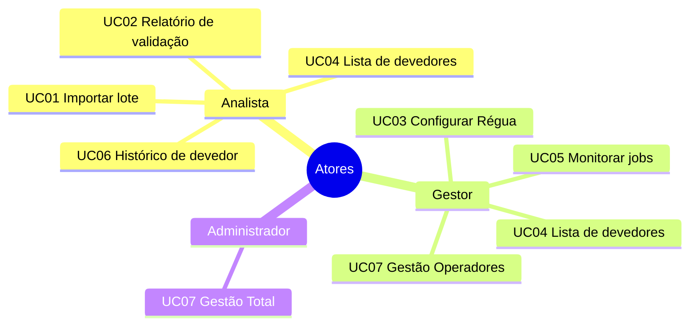
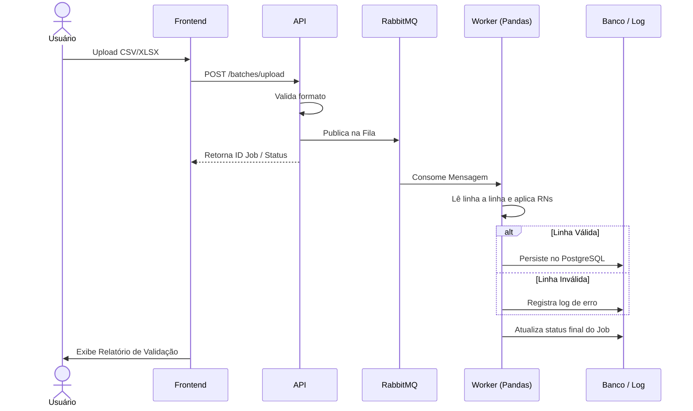
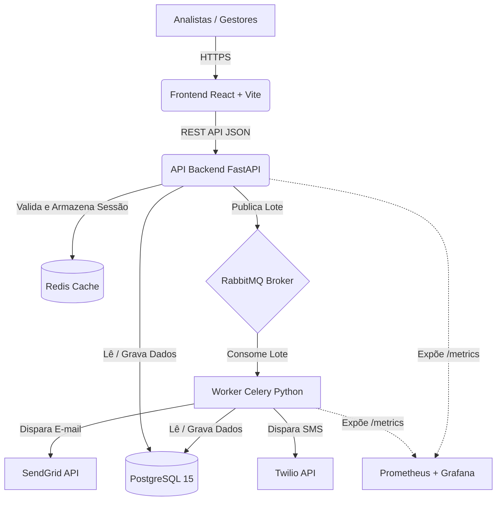

# Proposta Técnica de Projeto de Portfólio
## Plataforma de Cobrança Automatizada com Processamento de Dados e Gestão de Régua de Comunicação

**Instituição:** ENGENHARIA DE SOFTWARE - Católica SC  
**Linha de Projeto:** Web / Dados / Automação  
**Autor:** Mariele Vieira da Silva  
**Data da Proposta:** 12/04/2026  
**Versão:** 1.0  

---

## 1. Visão do Produto e Impacto

### 1.1 Contexto e Problema
A inadimplência é um desafio estrutural para empresas de diversos segmentos no Brasil. Segundo dados do Serasa Experian, o país ultrapassa 70 milhões de pessoas físicas inadimplentes, e empresas de médio porte perdem, em média, entre 3% e 8% da sua receita bruta anual em decorrência de cobranças mal executadas ou não realizadas.

O processo tradicional de cobrança é majoritariamente manual: analistas financeiros exportam planilhas do ERP (Enterprise Resource Planning), filtram manualmente os devedores, enviam e-mails individualmente e registram os contatos em outros sistemas. 

**Este fluxo apresenta limitações críticas:**
* Alto custo operacional com tarefas repetitivas e de baixo valor.
* Inconsistência na régua de comunicação; cada analista aplica regras diferentes.
* Ausência de rastreabilidade e auditoria das ações realizadas.
* Impossibilidade de escalar o volume de cobranças sem aumentar o quadro de funcionários.
* Dados de retorno (pagamentos, negociações) não realimentam o sistema de forma automatizada.

**A Solução:** Substituir esse fluxo por uma plataforma web integrada que automatiza a ingestão de dados de inadimplentes, aplica regras de cobrança configuráveis e executa disparos de comunicação multicanal (e-mail, SMS, WhatsApp) de forma programada e monitorada.

### 1.2 Origem da Demanda e Evidências
Foram realizadas entrevistas exploratórias com 5 profissionais da área financeira e 15 profissionais da área de cobrança da empresa parceira. As principais dores identificadas foram:

* **Processo Manual (100%):** Todos os entrevistados relatam que o processo de envio de comunicações de cobrança é realizado manualmente.
* **Falta de Padronização (100%):** Dificuldade de manter uma régua de cobrança padronizada entre diferentes analistas.
* **Falta de Rastreabilidade (80%):** Não possuem rastreabilidade sobre quais devedores receberam qual tipo de comunicação.
* **Ferramentas Inadequadas:** A empresa não utiliza uma solução dedicada integrada, usam combinações de planilhas no excel, e-mail corporativo e sistemas legados.

### 1.3 Análise de Soluções Existentes (Benchmark)

| Solução | Público-Alvo | Pontos Fortes | Limitações |
| :--- | :--- | :--- | :--- |
| **Receita Certa** | PMEs | Interface amigável, integração com Pix | Sem customização de régua, sem importação por CSV |
| **Assertiva Cobranças**| Empresas de médio porte | Automação básica de comunicação | Custo elevado, sem observabilidade |
| **Iugu / Vindi** | E-commerce e SaaS | Plataforma de pagamentos robusta | Foco em recorrência, não em cobranças de carteira |
| **Planilha + E-mail** | Qualquer empresa | Baixo custo, familiar | Sem automação, sem rastreabilidade, sem escala |

> **Diferencial do Projeto:** Nenhuma das soluções analisadas oferece simultaneamente: (1) importação flexível de lotes via CSV/Excel com validação automatizada; (2) configuração visual da régua de cobrança por perfil de devedor; (3) execução de jobs programados com monitoramento em tempo real via dashboard. A arquitetura será moderna, open source e auditável.

### 1.4 Público-Alvo
O sistema é direcionado a empresas de médio porte (cooperativas, varejistas, clínicas e prestadoras de serviço) que realizam a gestão interna de suas carteiras de inadimplentes. 

* **Usuário Primário:** Analista financeiro ou de cobrança (conhecimento tecnológico intermediário).
* **Usuário Secundário:** Gestor financeiro (focado em dashboards e regras de negócios).
* **Parceiro Institucional:** Desenvolvido em parceria com a Consulth Soluções Empresariais (CNPJ 33.536.315/0001-07), especialista em recuperação de crédito B2B.

### 1.5 Objetivos do Projeto
**Objetivo Geral**
Desenvolver uma plataforma web para automação do ciclo de cobrança de inadimplentes, desde a ingestão e validação de dados até o disparo multicanal de comunicações e o monitoramento dos resultados.

**Objetivos Específicos**
1. Implementar pipeline assíncrono de ingestão e validação de arquivos CSV/Excel com feedback de erros por linha.
2. Desenvolver módulo de configuração visual da régua de cobrança (canais e prazos por perfil).
3. Automatizar a execução de jobs de disparo (e-mail e SMS) com agendamento.
4. Criar dashboard de monitoramento com métricas de execução, entrega e conversão.
5. Garantir qualidade via TDD, CI/CD automatizado e análise estática via SonarCloud.

### 1.6 Métricas de Sucesso (KPIs)

| KPI | Meta |
| :--- | :--- |
| Tempo de resposta da API (P95) | < 300ms |
| Throughput de processamento de lote | > 10.000 registros/minuto |
| Cobertura de testes automatizados (backend) | >= 80% |
| Cobertura de testes (frontend) | >= 25% |
| Disponibilidade do serviço | >= 99% |
| Taxa de sucesso nos disparos de e-mail | > 95% |
| Qualidade Sonar Cloud (Quality Gate) | Aprovado (sem blockers/criticals) |

---

## 2. Engenharia de Requisitos

### 2.1 Personas

**Persona 1: Heloizi Vargas (Analista de Cobrança)**
* **Contexto:** Cooperativa de crédito. Gerencia 2.000 devedores por mês.
* **Objetivo:** Enviar comunicações sem processo manual linha a linha.
* **Dores:** Perde horas exportando ERP e enviando e-mails. Comete erros de filtro que geram cobranças indevidas e potenciais processos.

**Persona 2: Fellipe Junkes (Gestor Financeiro)**
* **Contexto:** Responsável pela estratégia de recuperação de crédito B2B.
* **Objetivo:** Visualizar em tempo real o desempenho das campanhas e ajustar a régua conforme o perfil.
* **Dores:** Falta de visibilidade das ações tomadas e da mensuração do retorno das comunicações.

### 2.2 Casos de Uso Principais

* **UC01:** Importar lote de devedores via arquivo CSV/Excel
* **UC02:** Visualizar relatório de validação do lote importado
* **UC03:** Configurar régua de cobrança (canal, prazo, mensagem)
* **UC04:** Visualizar lista de devedores e seus status de comunicação
* **UC05:** Monitorar execução dos jobs de disparo em tempo real
* **UC06:** Consultar histórico de comunicações enviadas por devedor
* **UC07:** Gerenciar usuários e permissões de acesso

### 2.3 Requisitos Funcionais
* **RF01:** Upload de arquivos CSV e Excel (.xlsx) com dados de devedores.
* **RF02:** Processamento de arquivo de forma assíncrona com exibição de progresso em tempo real.
* **RF03:** Validação linha a linha com relatório detalhado de erros.
* **RF04:** Configuração da régua de cobrança (canais: e-mail, SMS, WhatsApp; prazos e templates).
* **RF05:** Listagem de devedores com filtros (status, prazo, canal).
* **RF06:** Execução de jobs programados para disparo conforme régua.
* **RF07:** Registro do resultado de cada tentativa (sucesso, falha, bounce).
* **RF08:** Dashboard de métricas (disparos, entregas, conversões).
* **RF09:** Autenticação de usuários com controle de perfis (operador, gestor, admin).
* **RF10:** Gestão de usuários e permissões via módulo administrativo.

### 2.4 Requisitos Não Funcionais
* **RNF01:** Suportar ao menos 100 usuários simultâneos sem degradação.
* **RNF02:** Tempo de resposta da API < 300 ms (P95).
* **RNF03:** Pipeline de lotes deve suportar até 50.000 registros por arquivo.
* **RNF04:** Autenticação via JWT (short-lived + refresh token).
* **RNF05:** Dados sensíveis devem ser armazenados com criptografia em repouso.
* **RNF06:** Cobertura de testes >= 80% no backend (pytest).
* **RNF07:** CI/CD com Quality Gate obrigatório no Sonar Cloud.
* **RNF08:** Exposição de métricas Prometheus para Grafana.
* **RNF09:** Solução 100% conteinerizada (Docker / Docker Compose).

### 2.5 Regras de Negócio
* **RN01:** Apenas `operador` ou superior pode importar lotes.
* **RN02:** A régua só pode ser ativada com ao menos uma regra válida.
* **RN03:** Limite de 1 comunicação por canal/dia por devedor.
* **RN04:** Linhas com CPF/CNPJ inválido são totalmente rejeitadas da base.
* **RN05:** Disparos automáticos ocorrem apenas em dias úteis (08h00 - 20h00 BRT).
* **RN06:** Apenas administradores gerenciam usuários do sistema.

### 2.6 Fora do Escopo
* Integração direta com sistemas de pagamento/boletos.
* Portal de autoatendimento para o devedor final.
* Módulo de negociação/parcelamento.
* Importação automatizada (API direta) com ERPs.
* Suporte a canais de voz (robôs de ligação).
* Aplicativo mobile nativo.

---

## 3. Fluxos e Comportamento do Sistema

### 3.1 Fluxo Principal — Ingestão e Validação de Lotes

### 3.2 Fluxo Secundário — Execução da Régua de Cobrança

1. O **Scheduler (Celery Beat)** aciona o job no horário.
2. O **Worker** consulta a base por devedores elegíveis.
3. Para cada devedor, o Worker aciona a API correspondente (SendGrid para e-mail, Twilio para SMS).
4. Em caso de falha de conexão, agenda reenvio (máx 3 tentativas).
5. O resultado é gravado na tabela de comunicações.
6. O dashboard é atualizado com as métricas da operação.

### 3.3 Fluxos Alternativos e Exceções
* **Arquivo inválido:** Retorna HTTP 422 imediatamente.
* **Fila indisponível:** Retorna erro 503 com mensagem orientativa.
* **Falha de provedor externo (SendGrid/Twilio):** Retry automático de 30 minutos via broker.
* **Sessão expirada:** Redirecionamento instantâneo para login (HTTP 401).

---

## 4. Mockups e Experiência do Usuário (UX)

### Estrutura de Navegação

* **Fluxo 1 (Importação):** Dashboard → Importar Lote → Processando → Relatório de Validação.
* **Fluxo 2 (Régua):** Dashboard → Régua de Cobrança → Configurar Regra → Lista de Devedores.
* **Fluxo 3 (Monitoramento):** Dashboard → Monitoramento → Detalhe do Job → Histórico do Devedor.

### 4.2 Descrição das Telas Principais
**Link de acesso ao projeto no Figma:** [Acessar Projeto Figma](https://www.figma.com/design/aTgE91sZyzbxTrB8kh5clh/Plataforma-de-Cobran%C3%A7a-Automatizada?node-id=0-1&t=vxq6D6561lNc1dOZ-1)

* **Tela de Login:** Autenticação limpa corporativa, foco na conversão JWT.
* **Dashboard Principal:** Apresenta KPIs em cards (Total de devedores, disparos hoje, taxa de entrega, alertas de falha). Contém um gráfico (Timeline) de disparos dos últimos 7 dias.
* **Importar Lote:** Área de drag-and-drop. Informa regras e oferece botão "Baixar Planilha Modelo". Barra de progresso assíncrona.
* **Relatório de Validação:** Exibe Total Registros vs Sucessos vs Rejeitados (com porcentagens). Tabela de erros identifica a linha e a regra violada (ex: CPF inválido, Valor Negativo). Botão de exportação em CSV.
* **Régua de Cobrança:** Interface em "cards" de regras (ex: Lembrete 5 dias, SMS 15 dias, WhatsApp 30 dias). Tabela inferior lista os devedores no pipeline daquela regra.
* **Monitoramento:** Apresenta o log do sistema ao vivo no estilo "terminal" para o gestor acompanhar requisições externas e status code.

---

## 5. Arquitetura do Sistema

### 5.1 Diagramas C4

### 5.2 Modelo de Dados Simplificado
* `usuarios`: Gerenciamento de acesso e RBAC.
* `lotes` & `erro_lote`: Rastreabilidade de uploads assíncronos.
* `devedores`: Entidade central com dados financeiros e contato.
* `regras_colecao`: Parametrização da régua de disparos.
* `jobs` & `comunicacoes`: Logs transacionais de execução e auditoria.

### 5.3 Stack Tecnológica

| Componente | Tecnologia | Justificativa |
| :--- | :--- | :--- |
| **Backend** | Python 3.11 + FastAPI | Alta produtividade, validação nativa (Pydantic), assincronicidade. |
| **Frontend** | React 18 + Vite | SPAs performáticas, amplo ecossistema. |
| **Banco de Dados** | PostgreSQL 15 | Robusto, transacional, aderente a normas ACID. |
| **Filas / Tasks** | RabbitMQ + Celery | Desacoplamento perfeito para uploads massivos e agendamentos cron. |
| **Cache** | Redis | In-memory ágil para tokens e flags de sistema. |
| **Infraestrutura** | Docker + Compose | Imutabilidade e facilidade de deploy em VPS. |
| **CI / Qualidade** | GitHub Actions + SonarCloud | Garantia de qualidade via pipelines automatizados e análise estática. |
| **Monitoramento** | Prometheus + Grafana | Visibilidade de métricas e alertas padrão de mercado. |

---

## 6. Segurança e Privacidade

### 6.1 Controles de Segurança
* **Autenticação e Autorização:** JWT (access token 15 min + refresh token 7 dias em cookie HTTPOnly). Controle por RBAC estrito.
* **Mitigação OWASP:** Validação via Pydantic, parametrização via SQLAlchemy ORM (evita SQLi), Headers estritos de resposta (HSTS, CSP).
* **Infra:** TLS obrigatório via proxy reverso (Nginx), senhas em `bcrypt`, Rate Limiting em rotas públicas. DependaBot habilitado.

### 6.2 Privacidade (LGPD - Lei 13.709/2018)
* **Base Legal:** Dados coletados por clientes/parceiros (controladores). A plataforma atua como operadora.
* **Anonimização:** Logs expurgados após 90 dias.
* **Proteção:** Criptografia em nível de aplicação para dados sensíveis.
* **Direito ao Esquecimento (Art. 18):** Endpoint exclusivo para remoção permanente (hard delete) do rastro do devedor caso exigido.

---

## 7. Planejamento do Projeto

| Marco | Descrição | Prazo Estimado |
| :--- | :--- | :--- |
| **M1: Setup** | Infra, Repositórios, Docker, CI/CD Básico. | Semanas 1-2 |
| **M2: Ingestão** | Upload, Fila, Validação Pandas, Tabela de Erros, TDD. | Semanas 3-5 |
| **M3: Régua** | Configuração visual, Regras no banco, Status do Devedor. | Semanas 6-7 |
| **M4: Jobs** | Celery Beat, Integração Twilio/SendGrid, Dashboards. | Semanas 8-10 |
| **M5: Qualidade** | +80% Cobertura Testes, Zero Bugs SonarCloud, Métricas reais. | Semanas 11-12 |
| **M6: Deploy** | VPS, HTTPS, OpenAPI Swagger Documentado. | Semanas 13-14 |

---

## 8. Referências
* Documentações Oficiais: FastAPI, Celery, RabbitMQ, PostgreSQL, Docker, React.
* LGPD - Lei nº 13.709/2018.
* Referências Arquiteturais: Modelo C4 (Simon Brown), OWASP Top 10 (2021).

---

## 9. Apêndices

Os seguintes artefatos complementares devem ser incluídos neste documento após a fase de design:
* **Apêndice A:** Wireframes detalhados de todas as telas (Figma ou Excalidraw)
* **Apêndice B:** Diagrama Entidade-Relacionamento (DER) completo do banco de dados
* **Apêndice C:** Diagrama de sequência UML dos fluxos de ingestão e disparo
* **Apêndice D:** Exemplos de arquivos CSV aceitos e relatório de validação gerado
* **Apêndice E:** Configuração do pipeline GitHub Actions (arquivo .yml comentado)
* **Apêndice F:** Exemplos de métricas do Prometheus e painéis do Grafana
* **Apêndice G:** Transcrições das entrevistas com usuários realizadas na fase de descoberta

---

## 10. Parecer do Comitê de Avaliação

(A ser preenchido pelos professores avaliadores)

**Avaliador 1:** __________________________________________  
Status: [ ] Aprovado [ ] Ajustar  
Observações: _____________________________________________

**Avaliador 2:** __________________________________________  
Status: [ ] Aprovado [ ] Ajustar  
Observações: _____________________________________________

**Avaliador 3:** __________________________________________  
Status: [ ] Aprovado [ ] Ajustar  
Observações: _____________________________________________